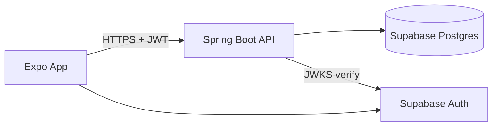
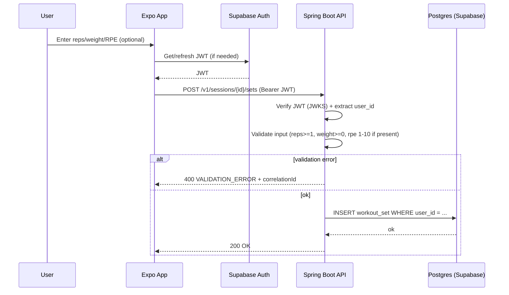
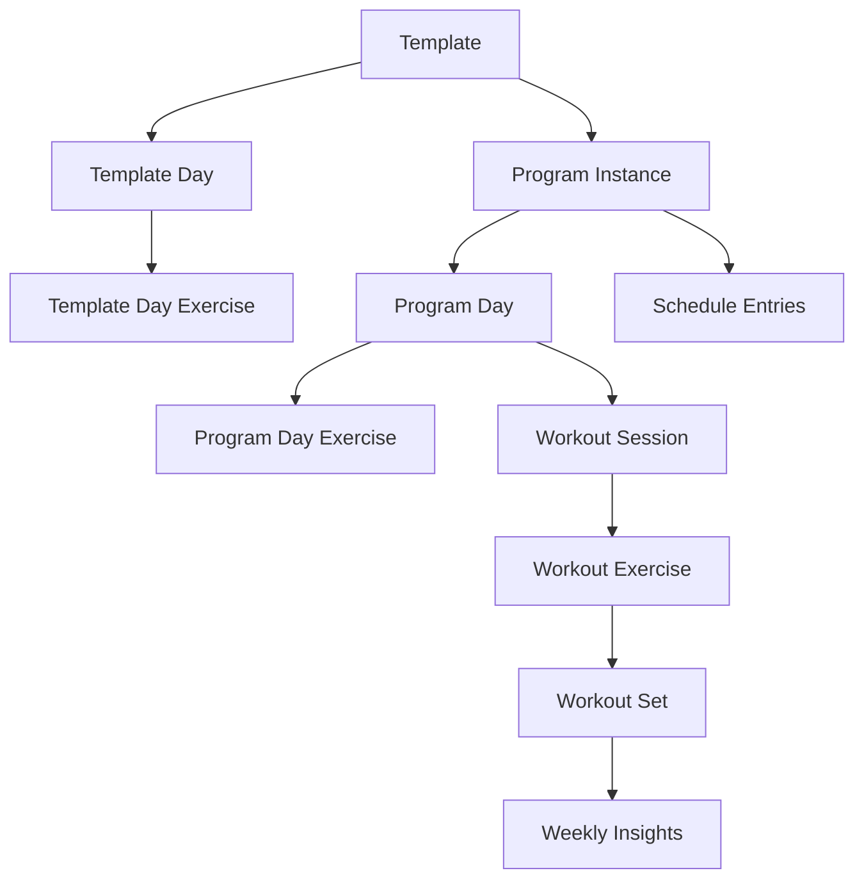
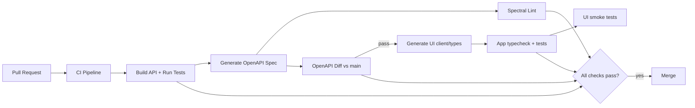

# Diagrams

## A) System context (C4-style)

```mermaid
flowchart LR
  A[Expo App] -->|HTTPS + JWT| B[Spring Boot API]
  B --> C[(Supabase Postgres)]
  A --> D[Supabase Auth]
  B -->|JWKS verify| D
```
## B) Sequence: Log a set

```mermaid
sequenceDiagram
  participant U as User
  participant App as Expo App
  participant Auth as Supabase Auth
  participant API as Spring Boot API
  participant DB as Postgres (Supabase)

  U->>App: Enter reps/weight/RPE (optional)
  App->>Auth: Get/refresh JWT (if needed)
  Auth-->>App: JWT
  App->>API: POST /v1/sessions/{id}/sets (Bearer JWT)
  API->>API: Verify JWT (JWKS) + extract user_id
  API->>API: Validate input (reps>=1, weight>=0, rpe 1-10 if present)
  alt validation error
    API-->>App: 400 VALIDATION_ERROR + correlationId
  else ok
    API->>DB: INSERT workout_set WHERE user_id = ...
    DB-->>API: ok
    API-->>App: 200 OK
  end
```
## C) Domain model

```mermaid
flowchart TD
    T[Template] --> TDY[Template Day]
    TDY --> TDE[Template Day Exercise]

    T --> PI[Program Instance]
    PI --> PD[Program Day]
    PD --> PDE[Program Day Exercise]

    PI --> SCH[Schedule Entries]

PD --> S[Workout Session]
S --> SE[Workout Exercise]
SE --> SET[Workout Set]

SET --> INS[Weekly Insights]
```
## D) Contract + CI/CD pipeline

```mermaid
flowchart LR
  PR[Pull Request] --> CI[CI Pipeline]
  CI --> APIBuild[Build API + Run Tests]
  APIBuild --> OpenAPI[Generate OpenAPI Spec]
  OpenAPI --> Spectral[Spectral Lint]
  OpenAPI --> Diff[OpenAPI Diff vs main]
  Diff -->|pass| ClientGen[Generate UI client/types]
  ClientGen --> AppTests[App typecheck + tests]
  AppTests --> E2E[UI smoke tests]
  Spectral --> Gate{All checks pass?}
  Diff --> Gate
  AppTests --> Gate
  APIBuild --> Gate
  Gate -->|yes| Merge[Merge]
```